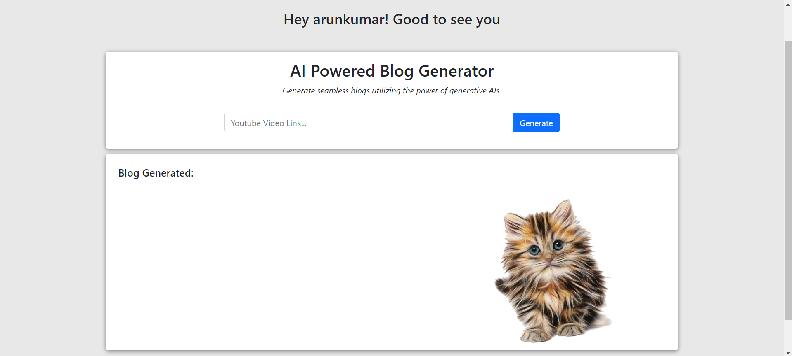
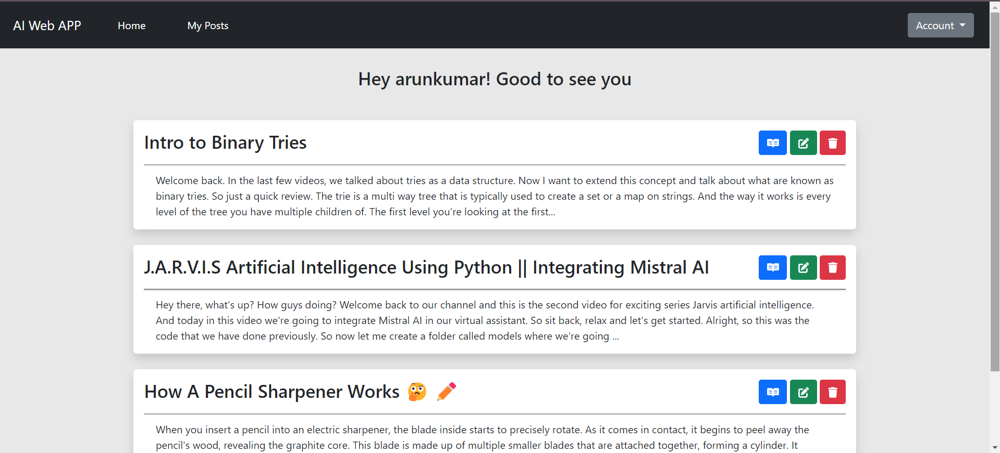
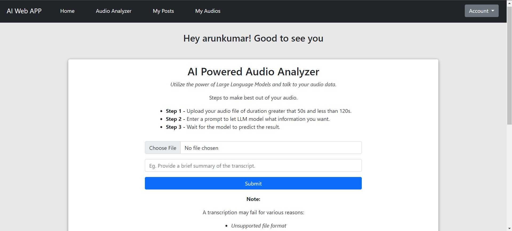
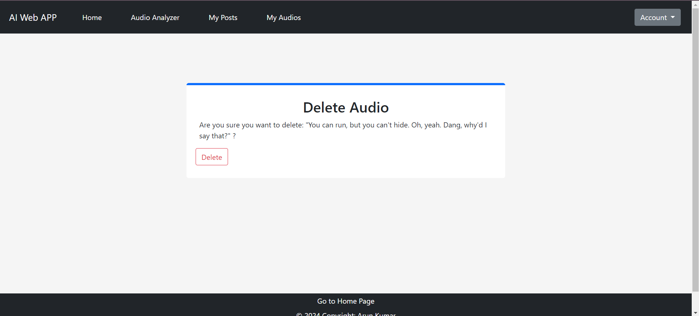
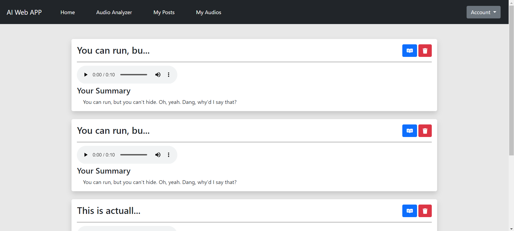
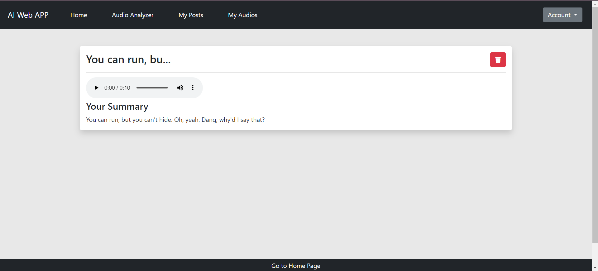

# AI Blog Generator

This AI Blog Generator is a powerful tool designed to transform YouTube videos into engaging articles effortlessly. By leveraging cutting-edge technologies such as PyTube, AssemblyAI, and OpenAI's GPT-3.5, this project automates the process of extracting transcripts from audio and generating polished blog content based on them.

## Technologies Used

- Python
- Django
- PyTube
- AssemblyAI
- OpenAI GPT-3.5
- HTML/CSS and Javscript

## Features

1. **YouTube Video Input:** Simply provide the link to the YouTube video you want to convert into a blog post.
2. **Transcript Extraction:** PyTube is utilized to download the audio, while AssemblyAI extracts precise transcripts from it.
3. **Content Generation:** OpenAI's GPT-3.5 model generates articulate articles based on the extracted transcript.
4. **CRUD Functionality:** Additionally, CRUD functionality has been implemented for the Blog Model, allowing users to Create, Read, Update, and Delete articles as needed.

## Getting Started
- Clone the repository:
```
git clone https://github.com/arunkumar02042002/ai_blog_generator.git
```

- Create a virtual environment and Install dependencies:
```
python -m venv .venv
pip install -r requirements.txt
```

- Change the Name of the .env-sample to env and Update the credentials

- After conneting to the database, run migrate command:

```
python manage.py migrate
```

- Run the application

```
python manage.py runserver
```

Access the application in your web browser at http://localhost:8000

## Usage
- Paste the YouTube video link into the provided input field.
- Click on the "Generate " button to initiate the process.
- Once the article is generated, you can view, edit, or delete it using the CRUD functionality.

## Home View




## My Posts
- Click on the My Posts to view all your articles generated



- Click on the buttons to read update and delete


# Audio Analyzer
Go to /analyzer/ enpoint for more information
- Upload your audio file - Language suported English
- Enter a prompt
- Wait for the result.

## Audio Analyzer View


## All audio analysis
- Go to /analyzer/audios or click My audios


## CRUD Operations
You can perform CRUD operations on all your analysis.

- Read


- Delete


# Installation
- Create a virtual environment
- Clone the Repository
- Install the dependency from the requirements.txt
- Set the environment Variables mentioned in the .env-sample
- Run the development server

# Contribution
Contributions are welcome! Feel free to submit bug reports, feature requests, or pull requests.

Feel free to add more details or sections as needed, such as installation instructions for specific environments or additional usage examples.